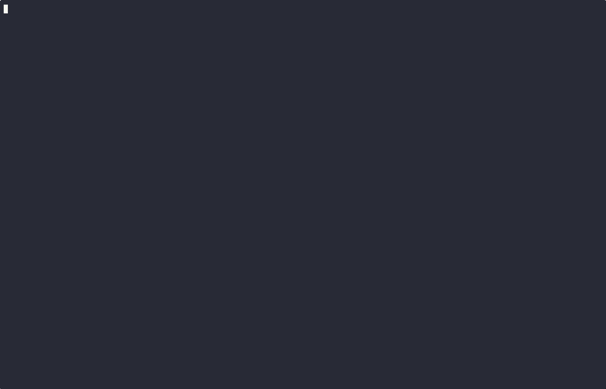

<picture>
  <source media="(prefers-color-scheme: dark)" srcset="./readme_assets/rule-kit-icon-dark.svg">
  <source media="(prefers-color-scheme: light)" srcset="./readme_assets/rule-kit-icon-light.svg">
  
</picture>

# Rulekit

Rulekit is a flexible expression-based rules engine for Go, providing a simple and expressive syntax for defining business rules that can be evaluated against key-value data.



## Overview

This package implements an expression-based rules engine that evaluates expressions against a key-value map of values, returning a true/false result with additional context.

Rules follow a simple and intuitive syntax. For example, the following rule:

```perl
domain matches /example\.com$/
```

When evaluated against:

- `map[string]any{"domain": "example.com"}` → returns **true**
- `map[string]any{"domain": "qpoint.io"}` → returns **false**

In this document, `domain` is referred to as a **field** and `/example\.com$/` as a **value**.

Rulekit supports a flexible syntax where fields and values may appear on either side of an operator:

- `field operator value` (e.g., `domain == "example.com"`)
- `value operator field` (e.g., `"example.com" == domain`)
- `value operator value` (e.g., `123 == 123`)
- `field operator field` (e.g., `src.port == dst.port`)

A field on its own (without an operator) will check if the field contains a non-zero value. For example: `hash && version > 1` will check if the hash field is non-zero and the version is greater than 1.

## Usage Example

```go
import "github.com/qpoint-io/rulekit"

// ...

r, err := rulekit.Parse(`domain matches /example\.com$/ and port == 8080`)
if err != nil { /* ... */ }

// define input data
input := rulekit.KV{
    "domain": "example.com",
    "port": 8080,
}

// evaluate the rule
result := r.Eval(&rulekit.Ctx{KV: input})

// check for errors, missing input, then the rule result
if result.Error != nil {
    fmt.Printf("error evaluating rule: %v\n", result.Error)
} else if result.Unknown() {
    fmt.Printf("missing fields: %v\n", result.MissingFields)
} else if result.Pass() {
    fmt.Println("PASS!")
} else {
    fmt.Println("FAIL :(")
}
```

## Result

When a rule is evaluated, it returns a `Result` struct containing:

- `Value`: The evaluated value, usually a boolean
- `Error`: Any operational evaluation error
- `MissingFields`: Fields required to complete evaluation but absent from the input
- `Trace`: Optional evaluation explanation when `Ctx.Trace` is enabled

The Result also provides additional helper methods:

- `Pass()`: Returns true if the rule completed and returned true/a non-zero value
- `Fail()`: Returns true if the rule completed and returned false/a zero value
- `Ok()` / `Complete()`: Returns true if the rule completed with no error or missing fields
- `Unknown()`: Returns true if the rule needs more input but did not otherwise fail

## Supported Operators

| Operator   | Alias  | Description                                                          |
| ---------- | ------ | -------------------------------------------------------------------- |
| `or`       | `\|\|` | Logical OR                                                           |
| `and`      | `&&`   | Logical AND                                                          |
| `not`      | `!`    | Logical NOT                                                          |
| `()`       |        | Parentheses for grouping                                             |
| `==`       | `eq`   | Equal to                                                             |
| `!=`       | `ne`   | Not equal to                                                         |
| `>`        | `gt`   | Greater than                                                         |
| `>=`       | `ge`   | Greater than or equal to                                             |
| `<`        | `lt`   | Less than                                                            |
| `<=`       | `le`   | Less than or equal to                                                |
| `contains` |        | Check if a value contains another value                              |
| `in`       |        | Check if a value is contained within an array or an IP within a CIDR |
| `matches`  |        | Match against a regular expression                                   |

## Supported Types

### Basic values

| Type                   | Used As      | Example                                                        | Description                                                                                                                                                                             |
| ---------------------- | ------------ | -------------------------------------------------------------- | --------------------------------------------------------------------------------------------------------------------------------------------------------------------------------------- |
| **bool**               | VALUE, FIELD | `true`                                                         | Valid values: `true`, `false`                                                                                                                                                           |
| **number**             | VALUE, FIELD | `8080`                                                         | Integer or float. Parsed as either int64 or uint64 if out of range for int64, or float64 if float.                                                                                      |
| **string**             | VALUE, FIELD | `"domain.com"`                                                 | A double-quoted string. Quotes may be escaped with a backslash: `"a string \"with\" quotes"`. Any quoted value is parsed as a string.                                                   |
| **IP address**         | VALUE, FIELD | `192.168.1.1`, `2001:db8:3333:4444:cccc:dddd:eeee:ffff`        | An IPv4, IPv6, or an IPv6 dual address. Maps to Go type: `net.IP`                                                                                                                       |
| **CIDR**               | VALUE        | `192.168.1.0/24`, `2001:db8:3333:4444:cccc:dddd:eeee:ffff/64`  | An IPv4 or IPv6 CIDR block. Maps to Go type: `*net.IPNet`                                                                                                                               |
| **Hexadecimal string** | VALUE, FIELD | `12:34:56:78:ab` (MAC address), `504f5354` (hex string "POST") | A hexadecimal string, optionally separated by colons.                                                                                                                                   |
| **Regex**              | VALUE        | `/example\.com$/`                                              | A Go-style regular expression. Must be surrounded by forward slashes. May not be quoted with double quotes (otherwise it will be parsed as a string). Maps to Go type: `*regexp.Regexp` |

### Constructs

| Type         | Used As | Example                        | Description                                                                                   |
| ------------ | ------- | ------------------------------ | --------------------------------------------------------------------------------------------- |
| **Array**    | VALUE   | `[1, "string", true]`          | An array of mixed value types. Can be used with most operators including `in` and `contains`. |
| **Function** | VALUE   | `starts_with(url, "https://")` | A function call with optional arguments. Can be built-in or custom.                           |
| **Macro**    | VALUE   | `isValidRequest()`             | A zero-argument function that encapsulates a predefined rule.                                 |

### Path Access

Dot syntax traverses nested maps and objects:

```perl
destination.ip == 192.168.1.1
```

Use bracket syntax for exact map keys that contain dots, spaces, slashes, reserved words, or other punctuation:

```perl
labels["app.kubernetes.io/name"] == "api"
request.headers["user-agent"] == "curl"
["destination.ip"] == 192.168.1.1
items[0].name == "first"
```

Plain dotted fields do not fall back to flat keys. If the input contains a top-level key named `destination.ip`, use `["destination.ip"]`.

### JSON Input Helpers

`DecodeJSON` converts JSON documents into `rulekit.KV`. Plain JSON decodes dynamically by default. Annotated key suffixes are opt-in and are intended for values that JSON cannot represent natively:

```go
kv, err := rulekit.DecodeJSON(data, rulekit.JSONOptions{AnnotatedKeys: true})
```

Supported suffixes include `.$ip`, `.$cidr`, `.$mac`, `.$hex`, `.$base64`, `.$bytes_hex`, `.$bytes_base64`, `.$string`, `.$bool`, `.$int64`, `.$uint64`, and `.$float64`.

Fully typed documents are a separate mode. In this mode, every field value must be a typed object and annotated keys are rejected:

```go
kv, err := rulekit.DecodeJSON(data, rulekit.JSONOptions{TypedDocument: true})
```

```json
{
  "src": { "$type": "ip", "value": "1.2.3.4" },
  "payload": { "$type": "bytes", "encoding": "hex", "value": "474554" },
  "u64": { "$type": "uint64", "value": "18446744073709551615" }
}
```

### AST API

Use `ParseAST` when tools need to inspect expression structure before compiling to an evaluator rule:

```go
ast, err := rulekit.ParseAST(`request.headers["user-agent"] == "curl"`)
if err != nil { /* ... */ }

fmt.Println(ast.String()) // compact canonical expression
rule, err := rulekit.Compile(ast)
```

The public AST view is read-only. Build edited expressions by parsing replacement source and compiling the resulting AST.

`AST.Tokens()` returns the token stream with byte spans plus leading and trailing whitespace/comment trivia for source-aware tools.

Use `Print` and `Format` for explicit output modes:

```go
source := rule.Print(rulekit.Source())
compact := rule.Print(rulekit.Compact())
multiline := rule.Print(rulekit.Multiline("  "))

formattedAST := rulekit.Format(ast, rulekit.Multiline("  "))
```

Use `Rewrite` to preserve unchanged source while replacing selected AST nodes:

```go
updated, err := rulekit.Rewrite(ast, []rulekit.Edit{{Target: node, Replacement: replacementAST}}, rulekit.Compact())
```

For repeated evaluation, `ParsePlan` and `CompilePlan` create an optional runtime plan over the lowered evaluator representation:

```go
plan, err := rulekit.ParsePlan(`ip in 192.168.0.0/16`)
result := plan.Eval(ctx)
```

Enable evaluation traces when a caller needs short-circuit visibility for debugging or UI explanation:

```go
result := rule.Eval(&rulekit.Ctx{KV: kv, Trace: true})
trace := result.Trace
```

Use `Input` adapters for lazy values or custom path resolution:

```go
input := rulekit.FromKV(rulekit.KV{
    "user": rulekit.LazyContextValue(func(ctx context.Context) (any, error) {
        return ctx.Value("user"), nil
    }),
})

result := rule.Eval(&rulekit.Ctx{Context: ctx, Input: input})
```

Nested `Input` values inside a `KV` can take over resolution for an entire subtree.

## Macros

Macros can be used for complex or commonly-used rules. They are defined in the evaluation context:

```go
// create macros
macros := rulekit.MacroSet{}
err := macros.Register("isInternalAPI", `domain matches /\.internal\.example\.com$/ or ip in 10.0.0.0/8`)
if err != nil { /* ... */ }

// create a rule that uses the macro
rule, err := rulekit.Parse(`isInternalAPI() && user != "root"`)
if err != nil { /* ... */ }

// evaluate the rule, making sure to pass the macro in the eval context
result := rule.Eval(&rulekit.Ctx{
    Macros: macros,
    KV: rulekit.KV{
        "user": user,
        // ...
    },
})
```

## Functions

Functions can be called inside rules and used as value objects. Functions may accept zero or more arguments.

### Standard library

Rulekit comes with a built-in standard library of functions:

| Function                     | Description                                                                                                                 | Example                        |
| ---------------------------- | --------------------------------------------------------------------------------------------------------------------------- | ------------------------------ |
| `starts_with(value, prefix)` | Checks if a value starts with the given prefix. Works with strings, numbers, and other types by converting them to strings. | `starts_with(url, "https://")` |

### Custom Functions

Custom functions may be used to extend Rulekit with additional functionality. Note that functions only have access to their arguments and do not have access to the context KV map. Rulekit will validate the function's arguments per the provided spec before executing the handler.

```go
// define a custom function
customFuncs := map[string]*rulekit.Function{
    "randomInt": {
        Args: []rulekit.FunctionArg{
            {Name: "min"},
            {Name: "max"},
        },
        Eval: func(args map[string]any) rulekit.Result {
            // use the rulekit.IndexFuncArg helper to retrieve args and validate types.
            // rulekit.IndexFuncArg[any] will skip type validation.
            min, err := rulekit.IndexFuncArg[int64](args, "min")
            if err != nil {
                return rulekit.Result{Error: err}
            }

            max, err := rulekit.IndexFuncArg[int64](args, "max")
            if err != nil {
                return rulekit.Result{Error: err}
            }

			num := rand.IntN(max-min) + min
			return rulekit.Result{
                Value: num,
            }
        },
    },
}

// call the function in a rule
rule, err := rulekit.Parse(`randomInt(10, 20) == 15`)
if err != nil { /* ... */ }

result := rule.Eval(&rulekit.Ctx{
    Functions: customFuncs,
})
if result.Error != nil { /* ... */ }

if result.Pass() {
    // the random number is 15!
}
```

## License

[MIT](./LICENSE)

<picture>
  <source media="(prefers-color-scheme: dark)" srcset="./readme_assets/qpoint-open.svg">
  <source media="(prefers-color-scheme: light)" srcset="./readme_assets/qpoint-open-light.svg">
  
</picture>
