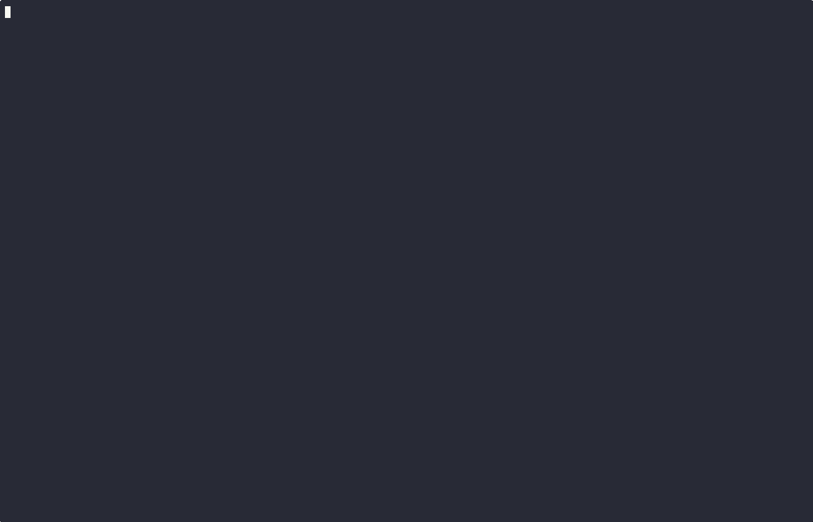

<picture>
  <source media="(prefers-color-scheme: dark)" srcset="./readme_assets/rule-kit-icon-dark.svg">
  <source media="(prefers-color-scheme: light)" srcset="./readme_assets/rule-kit-icon-light.svg">
  
</picture>

# Rulekit

Rulekit is a flexible expression-based rules engine for Go, providing a simple and expressive syntax for defining business rules that can be evaluated against key-value data.



## Overview

This package implements an expression-based rules engine that evaluates expressions against a key-value map of values, returning a true/false result with additional context.

Rules follow a simple and intuitive syntax. For example, the following rule:

```perl
domain matches /example\.com$/
```

When evaluated against:

- `map[string]any{"domain": "example.com"}` → returns **true**
- `map[string]any{"domain": "qpoint.io"}` → returns **false**

In this document, `domain` is referred to as a **field** and `/example\.com$/` as a **value**.

Rulekit supports a flexible syntax where fields and values may appear on either side of an operator:

- `field operator value` (e.g., `domain == "example.com"`)
- `value operator field` (e.g., `"example.com" == domain`)
- `value operator value` (e.g., `123 == 123`)
- `field operator field` (e.g., `src.port == dst.port`)

A field on its own (without an operator) will check if the field contains a non-zero value. For example: `hash && version > 1` will check if the hash field is non-zero and the version is greater than 1.

## Usage Example

```go
import "github.com/qpoint-io/rulekit/v2"

// ...

r, err := rulekit.Parse(`domain matches /example\.com$/ and port == 8080`)
if err != nil { /* ... */ }

// define input data
input := rulekit.KV{
    "domain": "example.com",
    "port": 8080,
}

// evaluate the rule
result := r.Eval(context.Background(), rulekit.FromKV(input), rulekit.Opts{})

// check for errors, missing input, then the rule result
if result.Error != nil {
    fmt.Printf("error evaluating rule: %v\n", result.Error)
} else if result.Unknown() {
    fmt.Printf("missing fields: %v\n", result.MissingFields)
} else if result.Pass() {
    fmt.Println("PASS!")
} else {
    fmt.Println("FAIL :(")
}
```

## Result

When a rule is evaluated, it returns a `Result` struct containing:

- `Value`: The evaluated value, usually a boolean
- `Error`: Any operational evaluation error
- `MissingFields`: Fields required to complete evaluation but absent from the input
- `Trace`: Optional evaluation explanation when `Opts.Trace` is enabled

The Result also provides additional helper methods:

- `Pass()`: Returns true if the rule completed and returned true/a non-zero value
- `Fail()`: Returns true if the rule completed and returned false/a zero value
- `Ok()` / `Complete()`: Returns true if the rule completed with no error or missing fields
- `Unknown()`: Returns true if the rule needs more input but did not otherwise fail

## Supported Operators

| Operator   | Alias  | Description                                                          |
| ---------- | ------ | -------------------------------------------------------------------- |
| `or`       | `\|\|` | Logical OR                                                           |
| `and`      | `&&`   | Logical AND                                                          |
| `not`      | `!`    | Logical NOT. Binds looser than comparisons, so `not a == 1` means `not (a == 1)` |
| `()`       |        | Parentheses for grouping                                             |
| `==`       | `eq`   | Equal to                                                             |
| `!=`       | `ne`   | Not equal to                                                         |
| `>`        | `gt`   | Greater than                                                         |
| `>=`       | `ge`   | Greater than or equal to                                             |
| `<`        | `lt`   | Less than                                                            |
| `<=`       | `le`   | Less than or equal to                                                |
| `contains` |        | A string contains a substring, an array contains an element, or a CIDR contains an IP |
| `in`       |        | A value is an element of an array, or an IP is within a CIDR. If the left side is an array, the check passes when ANY of its elements matches (same as `==` and `contains`) |
| `matches`  | `=~`   | Match against a regular expression                                   |
| `not contains`, `not in`, `not matches` | `not =~` | The negation of `contains`, `in`, or `matches`. `a not in [1, 2]` means `not (a in [1, 2])` |

## Supported Types

### Basic values

| Type                   | Used As      | Example                                                        | Description                                                                                                                                                                             |
| ---------------------- | ------------ | -------------------------------------------------------------- | --------------------------------------------------------------------------------------------------------------------------------------------------------------------------------------- |
| **bool**               | VALUE, FIELD | `true`                                                         | Valid values: `true`, `false` (any letter case)                                                                                                                                         |
| **number**             | VALUE, FIELD | `8080`, `0x1f`, `1_000`, `1.5`                                 | Integer or float. Integers may be decimal (leading zeros are still decimal: `010` is ten) or use a `0x`, `0o`, or `0b` prefix, with optional `_` separators. Parsed as int64, or uint64 if out of range for int64, or float64 if float. |
| **string**             | VALUE, FIELD | `"domain.com"`, `'domain.com'`                                 | A double- or single-quoted string. Both accept backslash escapes: `"a \"quoted\" word"`, `'it\'s'`. Must be valid UTF-8; use `x"..."` for arbitrary bytes. A quoted value is always a string, even if it looks like an IP address or URL. Comparing a string with an IP address, CIDR, MAC address, or URL compares against that value's text form (e.g. `"cafe::"` for the IPv6 address `CAFE::`). |
| **IP address**         | VALUE, FIELD | `192.168.1.1`, `2001:db8:3333:4444:cccc:dddd:eeee:ffff`        | An IPv4, IPv6, or an IPv6 dual address. Maps to Go type: `net.IP`                                                                                                                       |
| **CIDR**               | VALUE        | `192.168.1.0/24`, `2001:db8:3333:4444:cccc:dddd:eeee:ffff/64`  | An IPv4 or IPv6 CIDR block. Maps to Go type: `*net.IPNet`                                                                                                                               |
| **MAC address**        | FIELD        | `01:23:45:67:89:ab`                                            | A MAC address from the input. Compares as bytes with hexadecimal values such as `01:23:45:67:89:ab`, and with strings by its lowercase colon text. Maps to Go type: `net.HardwareAddr` |
| **Hexadecimal string** | VALUE, FIELD | `50:4f:53:54`, `x"504f5354"`, `x"0a"`                          | Bytes, written either as two or more colon-separated hex pairs or as hex digits in `x"..."` (`X` and single quotes also work). Equals a string with the same bytes (`x"504f5354" == "POST"`) or a MAC address with the same value. Eight colon-separated pairs read as an IPv6 address; use `x"..."` for 8-byte values. |
| **URL**                | FIELD        |                                                                | A URL from the input: an RFC 3986 URL in ASCII (see Text Forms). Compares with strings by its text. Maps to Go type: `rulekit.URL` (build one with `rulekit.ParseURL`). A `*url.URL` also works, compared by its `String()` form with a lowercase host                                                                                                    |
| **Regex**              | VALUE        | `/example\.com$/`, `/curl/i`, `\|a/b\|`                        | A regular expression in [RE2 syntax](https://github.com/google/re2/wiki/Syntax), surrounded by forward slashes or by `\|` (handy when the pattern contains `/`). May not be quoted with double quotes (otherwise it will be parsed as a string). Lowercase flags may follow the closing delimiter: `i` (ignore case), `m` (`^` and `$` match at line breaks), `s` (`.` matches newlines). `\d`, `\w`, and `\b` match ASCII only, and `\s` matches space, `\t`, `\n`, `\f`, and `\r`. Repetition counts go up to 1000. Not supported: `\Q...\E`, `\<` and `\>`, numeric escapes such as `\0` (use `\x{...}`), `{,n}` (use `{0,n}`), a `{` that does not start a repetition (use `\{`), `\p{^...}` (use `\P{...}`), nested classes, and `&&`, `--`, or `~~` inside a class. |

### Text Forms

When an IP address, CIDR, MAC address, or URL is compared with a string (with `==`, `!=`, `contains`, `matches`, or `in` a list of strings), it is compared by this text form:

| Type | Text form | Example |
| ---- | --------- | ------- |
| IPv4 address | Dotted decimal | `10.0.0.1` |
| IPv6 address | Lowercase, with the longest run of zero groups shortened to `::`. IPv4-mapped addresses (`::ffff:1.2.3.4`) print as IPv4 | `2001:db8::1`, `1.2.3.4` |
| CIDR | Network address, `/`, prefix length | `10.0.0.0/8` |
| MAC address | Lowercase hex pairs separated by `:` | `aa:bb:cc:dd:ee:ff` |
| URL | As written, with the scheme and host in lowercase; nothing is added, removed, or re-encoded | `https://example.com:443/a%20b?q=1` |

To compare by value instead, use an unquoted literal: `ip == 2001:DB8::1` matches however the address is written.

### Constructs

| Type         | Used As | Example                        | Description                                                                                   |
| ------------ | ------- | ------------------------------ | --------------------------------------------------------------------------------------------- |
| **Array**    | VALUE   | `[1, "string", true]`          | An array of mixed value types. Use it on the right of `in`, `==` (any element is equal), or `!=` (no element is equal), or on the left of `contains`. |
| **Function** | VALUE   | `starts_with(url, "https://")` | A function call with optional arguments. Can be built-in or custom.                           |
| **Macro**    | VALUE   | `isValidRequest()`             | A zero-argument function that encapsulates a predefined rule.                                 |

### Path Access

Dot syntax traverses nested maps and objects:

```perl
destination.ip == 192.168.1.1
```

Field names are ASCII: a letter or `_`, then letters, digits, `_`, `.`, or `-`. Use bracket syntax for exact map keys that contain other characters, such as spaces, slashes, non-ASCII letters, reserved words, or other punctuation:

```perl
labels["app.kubernetes.io/name"] == "api"
request.headers["user-agent"] == "curl"
["destination.ip"] == 192.168.1.1
items[0].name == "first"
```

Plain dotted fields do not fall back to flat keys. If the input contains a top-level key named `destination.ip`, use `["destination.ip"]`.

### Value Fields

IP addresses, CIDRs, MAC addresses, and URLs expose read-only fields using the same path syntax:

```perl
request.url.scheme == "https" and request.url.host == "api.example.com"
request.url.query["tag"] == "beta"
source.ip.version == "v6"
destination.net.prefix >= 24
device.mac.oui == 00:1a:2b
```

| Type | Field | Value |
| ---- | ----- | ----- |
| URL | `scheme` | Lowercase scheme, e.g. `"https"` |
| URL | `host` | Lowercase host name without the port |
| URL | `port` | Port number, if the URL has one |
| URL | `path` | Path as written, with percent escapes kept, e.g. `"/api/v1"` or `"/a%20b"` (`""` if empty) |
| URL | `query["name"]` or `query.name` | Query parameter value, decoded like an HTML form: pairs are separated by `&`, `+` is a space, and `%XX` escapes are decoded. A parameter given more than once is a list. `query` on its own is the raw query text |
| URL | `fragment` | Text after `#`, with `%XX` escapes decoded |
| URL | `user` | User name, with `%XX` escapes decoded |
| IP address | `version` | `"v4"` or `"v6"` |
| CIDR | `network` | Network address, e.g. `10.0.0.0` |
| CIDR | `prefix` | Prefix length, e.g. `16` |
| CIDR | `version` | `"v4"` or `"v6"` |
| MAC address | `oui` | First three bytes, e.g. `00:1a:2b` |

A field that the value doesn't have, such as `port` on `https://example.com`, is missing, so the rule result is unknown rather than false. Fields only apply to typed values: a map with a `host` key is read as a map, and a string is never treated as a URL.

### JSON Input Helpers

`DecodeJSON` converts JSON documents into `rulekit.KV`. Plain JSON decodes dynamically by default. Annotated key suffixes are opt-in and are intended for values that JSON cannot represent natively:

```go
kv, err := rulekit.DecodeJSON(data, rulekit.JSONOptions{AnnotatedKeys: true})
```

Supported suffixes include `.$ip`, `.$cidr`, `.$mac`, `.$url`, `.$hex`, `.$base64`, `.$bytes_hex`, `.$bytes_base64`, `.$string`, `.$bool`, `.$int64`, `.$uint64`, and `.$float64`.

Fully typed documents are a separate mode. In this mode, every field value must be a typed object and annotated keys are rejected:

```go
kv, err := rulekit.DecodeJSON(data, rulekit.JSONOptions{TypedDocument: true})
```

```json
{
  "src": { "$type": "ip", "value": "1.2.3.4" },
  "payload": { "$type": "bytes", "encoding": "hex", "value": "474554" },
  "u64": { "$type": "uint64", "value": "18446744073709551615" }
}
```

### AST API

Use `ParseAST` when tools need to inspect expression structure before compiling to an evaluator rule:

```go
ast, err := rulekit.ParseAST(`request.headers["user-agent"] == "curl"`)
if err != nil { /* ... */ }

fmt.Println(ast.String()) // compact canonical expression
rule, err := rulekit.Compile(ast)
```

The public AST view is read-only. Build edited expressions by parsing replacement source and compiling the resulting AST.

`AST.Tokens()` returns the token stream with byte spans plus leading and trailing whitespace/comment trivia for source-aware tools.

`json.Marshal(ast)` encodes the AST as JSON with the source, the node tree, and the tokens (excluding EOF). `ast.JSON()` returns the same document as Go values.

```go
ast, err := rulekit.ParseAST(`age >= 18`)
if err != nil { /* ... */ }
data, err := json.Marshal(ast)
```

```json
{
  "source": "age >= 18",
  "root": {
    "id": "root",
    "kind": "binary",
    "text": "age >= 18",
    "operator": "ge",
    "raw": ">=",
    "span": {"start": 0, "end": 9, "startLine": 1, "startColumn": 1, "endLine": 1, "endColumn": 10},
    "children": [
      {
        "id": "root.0",
        "kind": "path",
        "text": "age",
        "path": "age",
        "span": {"start": 0, "end": 3, "startLine": 1, "startColumn": 1, "endLine": 1, "endColumn": 4}
      },
      {
        "id": "root.1",
        "kind": "literal",
        "text": "18",
        "raw": "18",
        "span": {"start": 7, "end": 9, "startLine": 1, "startColumn": 8, "endLine": 1, "endColumn": 10}
      }
    ]
  },
  "tokens": [
    {"kind": "FIELD", "role": "id", "raw": "age", "span": {"start": 0, "end": 3, "startLine": 1, "startColumn": 1, "endLine": 1, "endColumn": 4}},
    {"kind": "GE", "role": "kw", "raw": ">=", "span": {"start": 4, "end": 6, "startLine": 1, "startColumn": 5, "endLine": 1, "endColumn": 7}},
    {"kind": "INT", "role": "num", "raw": "18", "span": {"start": 7, "end": 9, "startLine": 1, "startColumn": 8, "endLine": 1, "endColumn": 10}}
  ]
}
```

Node IDs are tree positions: `root`, then `<parent id>.<child index>`. `text` is the node's compact expression. Unary and binary nodes carry the normalized `operator` and its source spelling in `raw`; `not contains`, `not matches`, and `not in` carry the operator being negated plus `"negated": true`. Literals carry their source token in `raw`, calls their function name, and paths their rendered `path`. Spans are byte offsets with 1-based lines and byte columns. Token `role` is `id`, `str`, `num`, `kw`, or `pun`.

Use `Print` and `Format` for explicit output modes:

```go
source := rule.Print(rulekit.Source())
compact := rule.Print(rulekit.Compact())
multiline := rule.Print(rulekit.Multiline("  "))

formattedAST := rulekit.Format(ast, rulekit.Multiline("  "))
```

Use `Rewrite` to preserve unchanged source while replacing selected AST nodes:

```go
updated, err := rulekit.Rewrite(ast, []rulekit.Edit{{Target: node, Replacement: replacementAST}}, rulekit.Compact())
```

Enable evaluation traces when a caller needs short-circuit visibility for debugging or UI explanation:

```go
result := rule.Eval(context.Background(), rulekit.FromKV(kv), rulekit.Opts{Trace: true})
trace := result.Trace
```

Each trace node includes the expression, value, error, missing fields, and a `Status` of `passed`, `failed`, `missing`, `error`, `pruned`, or `unknown`. Short-circuited branches are marked as pruned.

Use `Input` adapters for lazy values or custom path resolution:

```go
input := rulekit.FromKV(rulekit.KV{
    "user": rulekit.LazyContextValue(func(ctx context.Context) (any, error) {
        return ctx.Value("user"), nil
    }),
})

result := rule.Eval(ctx, input, rulekit.Opts{})
```

Nested `Input` values inside a `KV` can take over resolution for an entire subtree.

## Macros

Macros can be used for complex or commonly-used rules. They are defined in the evaluation context:

```go
// create macros
macros := rulekit.MacroSet{}
err := macros.Register("isInternalAPI", `domain matches /\.internal\.example\.com$/ or ip in 10.0.0.0/8`)
if err != nil { /* ... */ }

// create a rule that uses the macro
rule, err := rulekit.Parse(`isInternalAPI() && user != "root"`)
if err != nil { /* ... */ }

// evaluate the rule, making sure to pass the macro in eval opts
input := rulekit.FromKV(rulekit.KV{
		"user": user,
		// ...
})
result := rule.Eval(context.Background(), input, rulekit.Opts{Macros: macros})
```

When tracing is enabled, a macro call appears as its own trace node with the expanded macro expression as a child.

## Functions

Functions can be called inside rules and used as value objects. Functions may accept zero or more arguments.

### Standard library

Rulekit comes with a built-in standard library of functions:

| Function                     | Description                                                                                                                 | Example                        |
| ---------------------------- | --------------------------------------------------------------------------------------------------------------------------- | ------------------------------ |
| `starts_with(value, prefix)` | Checks if a value starts with the given prefix. Both arguments must be strings or values with a text form (IP address, CIDR, MAC address, URL); other types are an error. | `starts_with(url, "https://")` |

### Custom Functions

Custom functions may be used to extend Rulekit with additional functionality. Note that functions only have access to their arguments and do not have access to the context KV map. Rulekit will validate the function's arguments per the provided spec before executing the handler.

```go
// define a custom function
customFuncs := map[string]*rulekit.Function{
    "randomInt": {
        Args: []rulekit.FunctionArg{
            {Name: "min"},
            {Name: "max"},
        },
        Eval: func(args map[string]any) rulekit.Result {
            // use the rulekit.IndexFuncArg helper to retrieve args and validate types.
            // rulekit.IndexFuncArg[any] will skip type validation.
            min, err := rulekit.IndexFuncArg[int64](args, "min")
            if err != nil {
                return rulekit.Result{Error: err}
            }

            max, err := rulekit.IndexFuncArg[int64](args, "max")
            if err != nil {
                return rulekit.Result{Error: err}
            }

            num := rand.Int64N(max-min) + min
            return rulekit.Result{
                Value: num,
            }
        },
    },
}

// call the function in a rule
rule, err := rulekit.Parse(`randomInt(10, 20) == 15`)
if err != nil { /* ... */ }

result := rule.Eval(context.Background(), nil, rulekit.Opts{Functions: customFuncs})
if result.Error != nil { /* ... */ }

if result.Pass() {
    // the random number is 15!
}
```

## License

[MIT](./LICENSE)

<picture>
  <source media="(prefers-color-scheme: dark)" srcset="./readme_assets/qpoint-open.svg">
  <source media="(prefers-color-scheme: light)" srcset="./readme_assets/qpoint-open-light.svg">
  
</picture>
