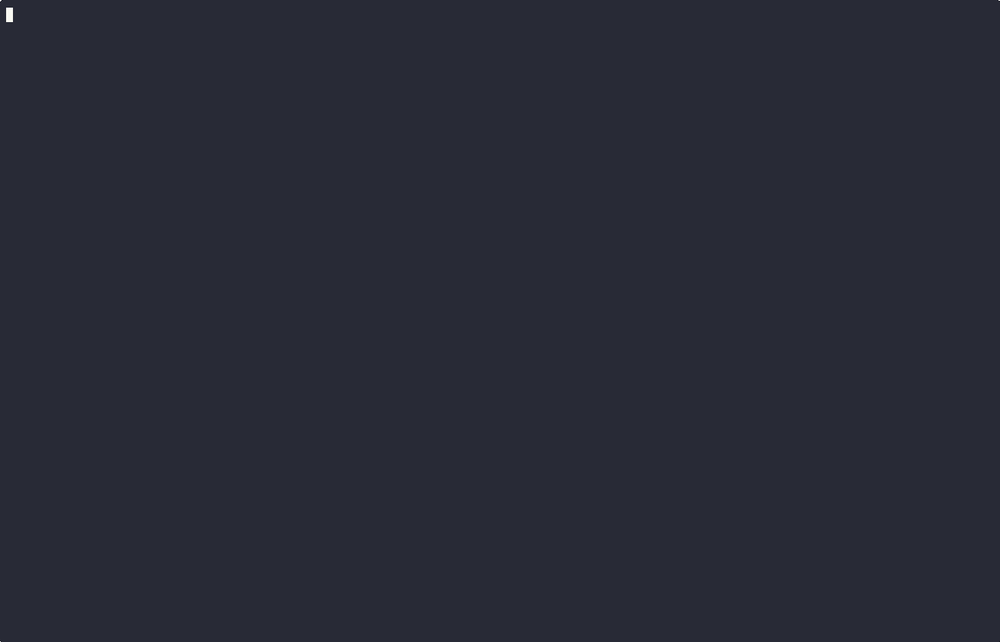

# Rulekit CLI Demo

A terminal-based demonstration tool for the [rulekit](https://github.com/qpoint-io/rulekit) package.

## Overview

This CLI tool provides an interactive way to test and experiment with rulekit expressions. You can:

- Write and evaluate rule expressions
- Create JSON test data 
- See immediate evaluation results
- Load example rules and test data

## Usage

Simply run the tool without any arguments:

```bash
# Run the tool
go run main.go

# Build the tool
go build -o rulecli main.go
./rulecli
```

### Keyboard Controls

| Key          | Action                        |
|--------------|-------------------------------|
| Tab          | Switch between rule and data  |
| Ctrl+E       | Evaluate rule                 |
| Ctrl+P       | Load an example rule/data pair|
| Ctrl+R       | Load an example rule          |
| Ctrl+D       | Load example data             |
| Ctrl+X       | Clear all inputs              |
| Ctrl+H       | Show help screen              |
| Esc          | Go back/close modal           |
| Ctrl+C       | Quit application              |

## Examples

The tool comes with 5 built-in examples that demonstrate different rulekit features:

1. Domain and port matching
2. IP CIDR notation and HTTP method matching
3. Status code range checking
4. User agent and path pattern matching
5. Numeric comparison operations

Press Ctrl+P to load any of these examples and see rulekit in action.

## Screenshot



## About

This demo is part of the rulekit package built at [Qpoint](https://qpoint.io).
